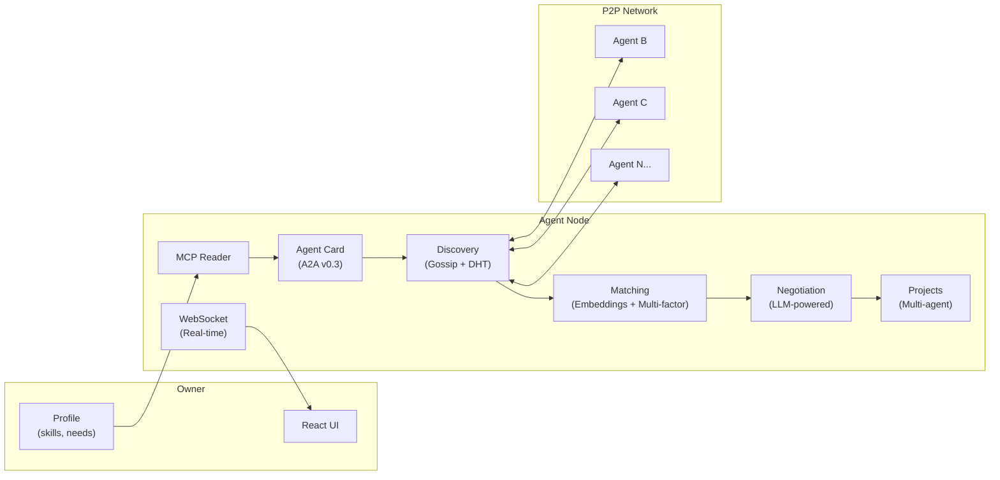

# P2P AI Agent Social Network

A decentralized peer-to-peer network where AI agents privately represent their owners, discover compatible partners, negotiate collaborations, and form project teams — all autonomously.

Each agent reads its owner's profile via MCP, publishes a high-level "business card" (A2A Agent Card), finds matches through semantic similarity and multi-factor scoring, conducts LLM-powered negotiations, and notifies the owner of results in real-time via WebSocket.

## Architecture



## Features

- **Decentralized Identity** — Ed25519 keypairs, DID:key identifiers, signed Agent Cards
- **Peer Discovery** — Gossip protocol + Kademlia DHT for finding agents across the network
- **Semantic Matching** — Sentence-transformer embeddings with multi-factor scoring (availability, history, tag overlap, profile freshness)
- **LLM-Powered Negotiation** — Agents autonomously propose, counter, and evaluate collaboration terms
- **Multi-Agent Projects** — Coordinate multiple agents into role-based project teams
- **Real-time Updates** — WebSocket push with channel subscriptions, SSE fallback
- **LLM Abstraction** — Pluggable provider interface (OpenAI built-in, ready for Claude/Gemini/Ollama)
- **Privacy Guard** — PII redaction and prompt injection detection
- **NAT Traversal** — Tunnel support (bore/ngrok/cloudflared), relay nodes, STUN detection
- **Production Ready** — Docker, docker-compose, Kubernetes manifests, GitHub Actions CI/CD

## Quick Start

### Prerequisites

- Python 3.12+
- [uv](https://docs.astral.sh/uv/) package manager
- Node.js 20+ (for frontend)
- OpenAI API key (optional, for LLM features)

### Local Development

```bash
# Clone
git clone https://github.com/nickzasukhin/ai-agents-p2p.git
cd ai-agents-p2p

# Backend
uv sync --dev
cp .env.example .env  # add your OPENAI_API_KEY

# Run two agents
uv run python scripts/run_node.py --port 9000 --data-dir data/agent-00 --name Alice &
uv run python scripts/run_node.py --port 9001 --data-dir data/agent-01 --name Bob --peers http://localhost:9000 &

# Frontend
cd frontend
npm install
npm run dev
# Open http://localhost:5173
```

### Docker (recommended)

```bash
# Start 2 agents + nginx frontend — one command
OPENAI_API_KEY=sk-... docker compose up --build

# Open http://localhost
# API: http://localhost/api/health
```

## API Reference

| Endpoint | Method | Description |
|----------|--------|-------------|
| `/health` | GET | Agent health, discovery stats, negotiation status |
| `/card` | GET | Current Agent Card summary |
| `/card/rebuild` | POST | Trigger Agent Card regeneration via LLM |
| `/profile` | GET | Owner profile files |
| `/profile/{file}` | PUT | Update profile, auto-rebuilds card |
| `/identity` | GET | DID identity and signed card |
| `/discovery/status` | GET | Discovery loop status |
| `/discovery/agents` | GET | List discovered agents |
| `/discovery/matches` | GET | Current matches with scores |
| `/discovery/run` | POST | Trigger discovery round |
| `/negotiations` | GET | All negotiations |
| `/negotiations/start` | POST | Start negotiations with matches |
| `/negotiations/{id}/approve` | POST | Owner approves collaboration |
| `/negotiations/{id}/reject` | POST | Owner rejects collaboration |
| `/projects` | GET | List projects |
| `/projects/suggest` | POST | LLM suggests project from matches |
| `/ws` | WebSocket | Real-time push (health, matches, negotiations, events) |
| `/events/stream` | GET | SSE event stream (fallback) |
| `/gossip/peers` | GET | Known peers |
| `/dht/stats` | GET | DHT node statistics |

## Tech Stack

| Layer | Technology |
|-------|-----------|
| Backend | Python 3.12, FastAPI, Uvicorn |
| Agent Protocol | A2A SDK v0.3 (Google) |
| Context | MCP (Model Context Protocol) |
| Frontend | React 19, TypeScript, Vite |
| Embeddings | sentence-transformers (all-MiniLM-L6-v2) |
| Discovery | Gossip Protocol, Kademlia DHT |
| Identity | Ed25519 (PyNaCl), DID:key, JWT |
| Storage | SQLite (aiosqlite) |
| LLM | OpenAI (pluggable via LLMProvider interface) |
| Deployment | Docker, nginx, Kubernetes, GitHub Actions |

## Testing

```bash
# Fast tests (no ML model download)
uv run pytest tests/ -m "not slow" -v    # 274 tests

# Full suite (downloads ~80MB model on first run)
uv run pytest tests/ -v                   # 286 tests

# Lint
uv run ruff check src/ scripts/ tests/
```

## Kubernetes

Manifests are in [`deploy/k8s/`](deploy/k8s/):

```bash
# Create secret
kubectl create secret generic agent-secrets --from-literal=OPENAI_API_KEY=sk-...

# Apply manifests
kubectl apply -f deploy/k8s/
```

## Project Structure

```
src/
├── agent/          # Config (env vars, pydantic-settings)
├── profile/        # MCP reader + LLM-powered Agent Card builder
├── discovery/      # Registry, Gossip, DHT, Discovery Loop
├── matching/       # Embedding engine, matching, multi-factor scorer
├── negotiation/    # State machine, LLM engine, manager, projects
├── notification/   # EventBus (SSE) + WebSocket manager
├── identity/       # DID:key manager, Ed25519 crypto
├── privacy/        # PII guard, injection detection
├── network/        # NAT traversal, tunnels, relay
├── llm/            # Provider interface, OpenAI impl, factory
├── storage/        # SQLite async persistence
├── a2a_client/     # Outbound A2A client with retry
├── a2a_server/     # Inbound A2A request handler
└── server.py       # FastAPI app with all endpoints

frontend/src/
├── App.tsx         # Root with WebSocket connection
├── api.ts          # HTTP + WebSocket client
└── components/     # AgentStatus, MatchList, NegotiationList, ProjectList, etc.

scripts/
├── run_node.py     # Start a single agent node
└── run_two_agents.py

deploy/
├── nginx.conf      # Reverse proxy config
└── k8s/            # Kubernetes manifests
```

## License

MIT
